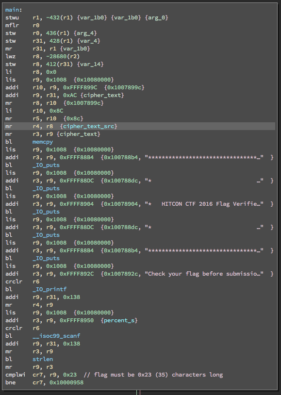
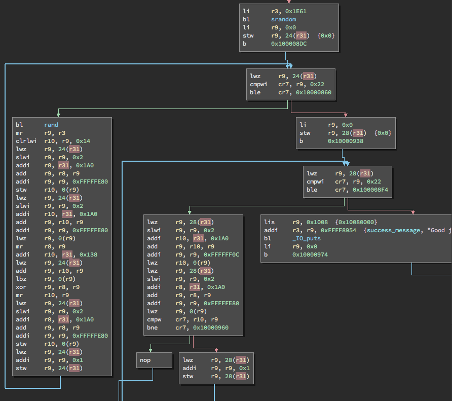

# flame (category: ppc)

69 Teams solved. Description "Evaluate your programming skill now"

# Solution

```
$ file flame
flame: ELF 32-bit MSB executable, PowerPC or cisco 4500, version 1 (SYSV), statically linked, for GNU/Linux 3.2.0, BuildID[sha1]=e2af32ab94ae0f7ccf65f91d9337452a5158a30a, not stripped
```

Statically linked PowerPC binary with symbols. Yea! First a little bit about PowerPC. PowerPC is a load/store RISC architecture. R3, R4, R5 are used to
pass arguments to functions and R3 is used for return values.

So, let's look at it.  The screenshot below is the disassembly of the
first portion of `main()`. It allocates 432 bytes of stack (R1 is
conventionally the stack pointer). It calls `memcpy()`, prints some stuff, and then prompts for a key.



The `memcpy()` above copies 0x8c (140) bytes from the data section to
`r31+0xac` (what I've labeled `cipher_text`). The string read by `scanf()`
is placed into the bytes starting at `r31+0x138`. The length of the string must be exactly 0x23 (35) bytes long (hmm, 35 * 4 == 140...).

Ok, now there's a call to `srandom(0x1e61)`: seed the libc random number generator with 7777. Then there's a loop from 0 to 0x22 (inclusive) (left hand long block) and another loop from 0 to 0x22 (inclusive).



Let's look at the left loop. There are three store (`stw`) instructions and several loads. This loop reads stuff from memory, operates on it, and stores it back. The bottom `stw` increments the value stored at `r31+24` (loop counter). So what does the rest of the block do?

It turns out the pseudo code for this is:

```c
uint32_t intbuf[0x23]; // starts at r31+0x20
uint8_t mystring[0x23];   // starts at r31+0x138
int i;

for (i = 0; i <= 0x22; i++) {
  intbuf[i] = (rand() & 0xfff) ^ mystring[i];
}
```

So, encode the string we type but promoting each byte to an integer and then xor the integer with the output of the libc `rand()` function.

The loop in the middle has pseudo code like so:

```c
uint32_t intbuf[0x23];      // starts at r31+0x20
uint32_t cipher_text[0x23]; // starts at r31+0xac
int i;

for (i = 0; i < 0x22; i++) {
  if (intbuf[i] != cipher_text[i])
    goto fail;
}
success();
```

So, all we really need to do, is extract the cipher integers from the data section (`data_1007889c`), extract the least significant byte from each integer and xor it with the libc `rand()` function (x.c)[x.c].

# Tools used

binary ninja

# Resources

* original binary [flame](flame)
* binary ninja database [flame.bndb](flame.bndb)
* solution code [x.c](x.c)
